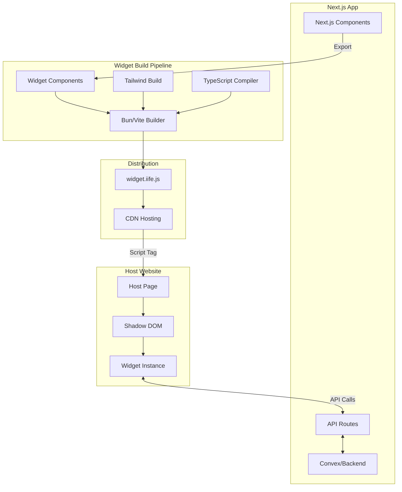
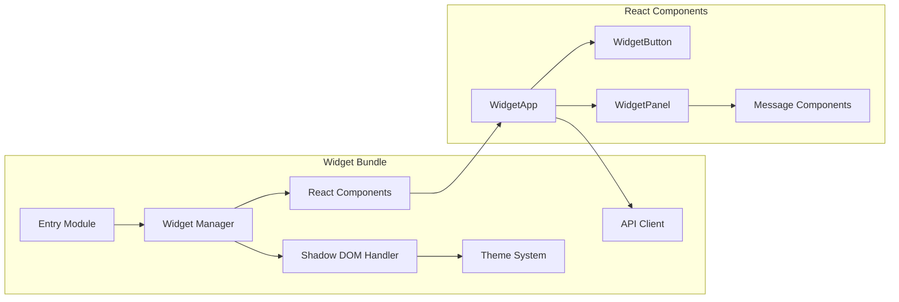
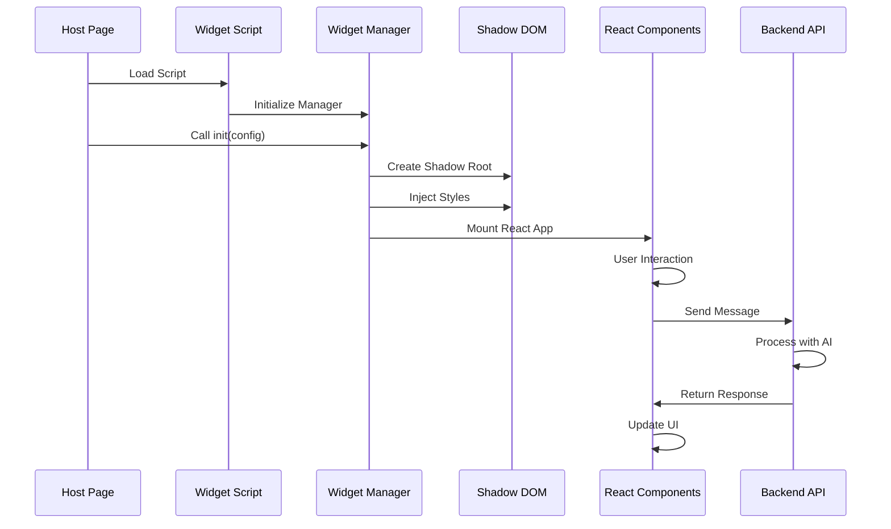
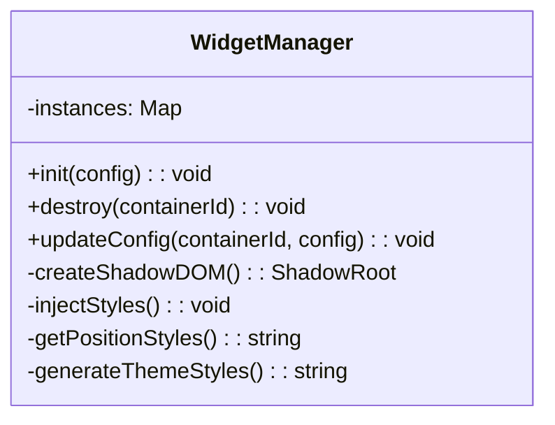
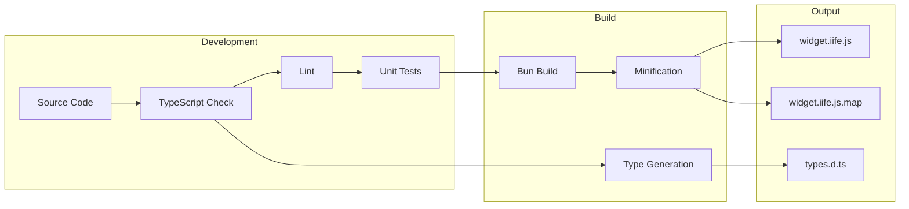
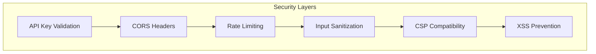

# React Component Embeddable Widget Architecture

## Table of Contents
1. [Overview](#overview)
2. [Context & Requirements](#context--requirements)
3. [Architecture Design](#architecture-design)
4. [Technical Stack](#technical-stack)
5. [Module Breakdown](#module-breakdown)
6. [Build & Deployment Pipeline](#build--deployment-pipeline)
7. [Integration Guide](#integration-guide)
8. [Security & Performance](#security--performance)
9. [API Reference](#api-reference)

## Overview

This document outlines a production-ready architecture for transforming React 19.1 components from a Next.js 15.4.5 application into embeddable third-party widgets. The solution provides complete style isolation, configuration flexibility, and seamless integration capabilities while maintaining a small bundle size.

## Context & Requirements

### Initial Requirements
Based on our discussion, the following requirements were identified:

- **Component Type**: Interactive, AI-powered widget with button-to-panel transition
- **Backend Communication**: Required for AI interactions
- **Multiple Instances**: Not required initially
- **Style Isolation**: Complete isolation from host page styles
- **Browser Compatibility**: Modern browsers initially
- **State Sharing**: Not required between instances
- **Customization**: Core requirement for configuration and styling

### Technical Constraints
- Use React 19.1 and modern features
- Leverage Bun as primary build tool (Vite as fallback)
- Integrate Tailwind CSS v4 for styling
- Maintain TypeScript throughout
- Target ~50KB bundle size

## Architecture Design

### High-Level Architecture



### Component Architecture



### Data Flow



## Technical Stack

### Core Technologies
- **React**: 19.1.0 - Latest features including improved hydration
- **TypeScript**: 5.5.0 - Full type safety
- **Tailwind CSS**: 4.0.0 - New @theme directive for custom properties
- **Bun**: Latest - Primary build tool and runtime
- **Vite**: 5.3.0 - Alternative bundler

### Build Tools
- **Lightning CSS**: For Tailwind v4 processing
- **Terser**: JavaScript minification
- **TypeScript Compiler**: Type definitions generation

### Architecture Patterns
- **Shadow DOM**: Complete style isolation
- **IIFE Bundle**: Self-contained global script
- **Event-Driven**: Callback-based integration
- **Singleton Manager**: Centralized widget control

## Module Breakdown

### 1. Build Configuration (`build.widget.ts`)

The build configuration uses Bun's native bundler with custom plugins:

```typescript
// Key features:
- IIFE format for global scope execution
- Tailwind CSS v4 transformation via Lightning CSS
- Complete dependency bundling (including React)
- Source map generation for debugging
- ~50KB target bundle size
```

**Alternative Vite Configuration**: Provided for teams preferring Vite or needing specific Rollup plugins.

### 2. Widget Entry Point (`src/widget/index.tsx`)

The entry point serves multiple critical functions:

```typescript
// Responsibilities:
1. Global namespace management (window.MyWidget)
2. Shadow DOM creation and management
3. Style injection and isolation
4. React root initialization
5. Auto-initialization from data attributes
6. Instance lifecycle management
```

**Key Features**:
- Multiple instance support (future-ready)
- Automatic cleanup on destroy
- Configuration updates without remounting
- Position-aware rendering

### 3. Widget Manager Class

The `WidgetManager` implements the singleton pattern:



### 4. React Components

#### WidgetApp Component
The main orchestrator component handling:
- State management for open/closed states
- Message history
- API communication
- Event callback execution
- Keyboard shortcuts (ESC to close)

#### WidgetButton Component
- Animated call-to-action button
- Pulse animation for attention
- Accessible ARIA labels
- Click handler for opening panel

#### WidgetPanel Component
- Message display with auto-scroll
- Input handling with validation
- Loading states with typing indicator
- Error display
- Responsive design

### 5. API Integration (`hooks/useWidgetApi.ts`)

Custom hook for backend communication:

```typescript
// Features:
- Automatic loading state management
- Error handling and retry logic
- Bearer token authentication
- Message history context
- TypeScript-typed responses
```

### 6. Styling System (`widget.tailwind.css`)

Tailwind CSS v4 configuration with:
- CSS custom properties for theming
- Shadow DOM-specific resets
- Animation utilities
- Dark mode support
- Mobile responsive design

```css
/* Theme System */
@theme {
  --color-widget-primary: var(--widget-primary, #3b82f6);
  --color-widget-bg: var(--widget-bg, #ffffff);
  --color-widget-text: var(--widget-text, #000000);
  --color-widget-border: var(--widget-border, #e5e7eb);
}
```

## Build & Deployment Pipeline

### Build Process



### Deployment Strategy

1. **Build Command**: `bun run build`
2. **Output**: Single IIFE bundle with embedded styles
3. **CDN Upload**: Deploy to edge CDN with proper headers
4. **Versioning**: Use semantic versioning with CDN paths
5. **Caching**: Set appropriate cache headers

### CDN Configuration

```nginx
# Example CDN headers
Content-Type: application/javascript
Cache-Control: public, max-age=31536000
Access-Control-Allow-Origin: *
Content-Encoding: gzip
```

## Integration Guide

### Basic Integration

```html
<!-- Simplest integration -->
<script 
  src="https://cdn.yourservice.com/widget.iife.js"
  data-widget-config='{"containerId": "ai-widget", "apiKey": "key"}'
></script>
```

### Advanced Integration

```javascript
// Programmatic initialization
window.MyWidget.init({
  containerId: 'ai-widget',
  apiKey: 'your-api-key',
  theme: 'custom',
  customStyles: {
    '--widget-primary': '#8b5cf6'
  },
  onMessage: (message) => {
    analytics.track('widget_message', message);
  }
});
```

### Next.js Integration

The solution provides multiple integration patterns:

1. **Global Layout Integration**: Load widget site-wide
2. **Page-Specific Loading**: Use Next.js Script component
3. **Component Wrapper**: React component for widget lifecycle

## Security & Performance

### Security Measures



1. **API Authentication**: Bearer token validation
2. **Cross-Origin**: Proper CORS configuration
3. **Content Security**: Shadow DOM respects CSP
4. **Input Validation**: Server-side sanitization
5. **Rate Limiting**: Prevent API abuse

### Performance Optimizations

1. **Lazy Loading**: Widget loads on-demand
2. **Code Splitting**: Minimal initial payload
3. **Tree Shaking**: Remove unused React code
4. **CSS Purging**: Include only used styles
5. **Compression**: Gzip/Brotli support
6. **Caching**: Long-term CDN caching

### Bundle Size Analysis

```
Target: ~50KB (gzipped)
- React DOM: ~35KB
- Widget Code: ~10KB
- Styles: ~5KB
```

## API Reference

### Configuration Interface

```typescript
interface WidgetConfig {
  // Required
  containerId: string;
  apiKey: string;
  
  // Optional
  apiEndpoint?: string;
  theme?: 'light' | 'dark' | 'custom';
  position?: 'bottom-right' | 'bottom-left' | 'top-right' | 'top-left' | 'center';
  customStyles?: Record<string, string>;
  initialOpen?: boolean;
  buttonText?: string;
  headerTitle?: string;
  placeholder?: string;
  
  // Callbacks
  onReady?: () => void;
  onMessage?: (message: Message) => void;
  onOpen?: () => void;
  onClose?: () => void;
}
```

### Global Methods

```typescript
window.MyWidget = {
  // Initialize a new widget instance
  init(config: WidgetConfig): void;
  
  // Destroy a widget instance
  destroy(containerId: string): void;
  
  // Update configuration
  updateConfig(containerId: string, config: Partial<WidgetConfig>): void;
  
  // Access to all instances (readonly)
  instances: Map<string, WidgetInstance>;
};
```

### Message Interface

```typescript
interface Message {
  id: string;
  text: string;
  sender: 'user' | 'ai';
  timestamp: Date;
  metadata?: Record<string, any>;
}
```

## Best Practices

### For Widget Developers

1. **Version Management**: Use semantic versioning
2. **Backward Compatibility**: Maintain API stability
3. **Error Boundaries**: Implement React error boundaries
4. **Performance Monitoring**: Track widget metrics
5. **A/B Testing**: Support feature flags

### for Integration Partners

1. **Async Loading**: Always load widget asynchronously
2. **Error Handling**: Wrap initialization in try-catch
3. **Event Tracking**: Utilize callback functions
4. **Custom Styling**: Use CSS custom properties
5. **Accessibility**: Ensure keyboard navigation works

## Conclusion

This architecture provides a robust, scalable solution for embedding React components as third-party widgets. The use of Shadow DOM ensures complete isolation, while the modern build pipeline keeps bundle sizes minimal. The solution is production-ready and supports extensive customization while maintaining security and performance standards.

### Key Achievements

- ✅ Complete style isolation via Shadow DOM
- ✅ < 50KB bundle size target
- ✅ Full TypeScript support
- ✅ Tailwind CSS v4 integration
- ✅ Flexible theming system
- ✅ Secure API communication
- ✅ Multiple integration methods
- ✅ Production-ready error handling

### Future Enhancements

1. **Multi-instance Support**: Enable multiple widgets per page
2. **Plugin System**: Allow custom extensions
3. **Analytics Integration**: Built-in usage tracking
4. **Offline Support**: Service worker integration
5. **i18n Support**: Multi-language capabilities